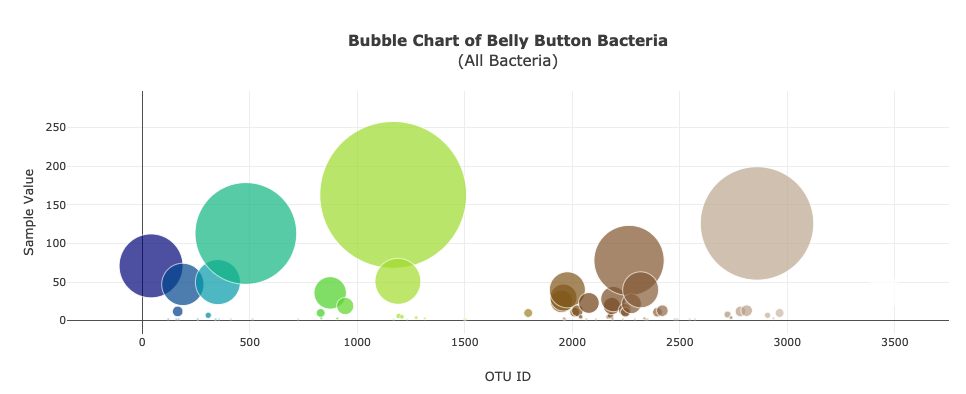

# web_dashboard
UofT SCS Data Analytics Bootcamp's Unit 15 Assignment (Web Visualizations using Javascript, Plotly, SQLite, and Flask)
   
<strong>Please view my completed web dashboard at this link: 
  - [https://belly-button-biodiversity-dshb.herokuapp.com/](https://belly-button-biodiversity-dshb.herokuapp.com/)</strong>
  

# Unit 15 | Assignment - Belly Button Biodiversity

Build an interactive dashboard to explore the [Belly Button Biodiversity DataSet](http://robdunnlab.com/projects/belly-button-biodiversity/).

## Step 1 - Plotly.js

Build interactive charts using Plotly.js

* PIE chart that uses data from the samples route (`/samples/<sample>`) to display the top 10 samples.

  

* Bubble Chart that uses data from the samples route (`/samples/<sample>`) to display each sample.

  

* Display the sample metadata from the route `/metadata/<sample>`

* Update all of the plots any time that a new sample is selected.

## Step 2 - Heroku

Deploy the Flask app to Heroku using the provided sqlite file for the database:

## Advanced Challenge Assignment (Optional)

The following task is completely optional and is very advanced.

* Adapt the Gauge Chart from <https://plot.ly/javascript/gauge-charts/> to plot the Weekly Washing Frequency obtained from the route `/wfreq/<sample>`

- - -

### Copyright

Data Boot Camp © 2018. All Rights Reserved.

